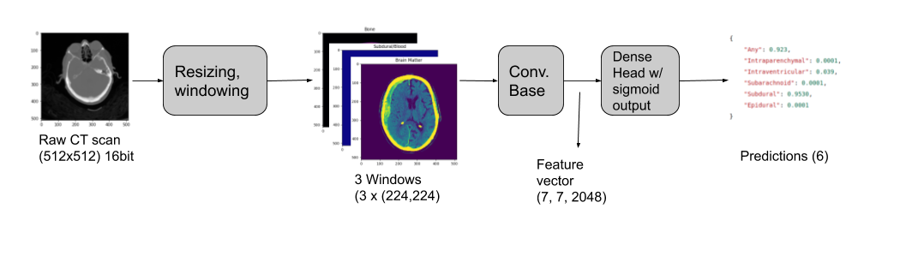

# 🧠 Intracranial Hemorrhage Detection using Deep Learning 

In this project we detect and diagnose the type of hemorrhage in CT scans using Deep Learning!



The training code is available in ```train.py```. Code for the metrics reported in the paper is available in ```notebooks/Week 11 - tlewicki - metrics clean.ipynb```.

## Setup instructions:

1. The dataset can be downloaded from [here](https://www.kaggle.com/c/rsna-intracranial-hemorrhage-detection/data) (the dataset 500 GB). There's a dowloaded and unzipped version on SJSU HPC disk at: ```'/data/cmpe257-02-fa2019/team-1-meerkats/rsna-intracranial-hemorrhage-detection/'```

2. Install the requirements and activate the virtual environment:
```shell
conda env create -f environment.yml
conda activate brainenv
```
3. Install pydicom (not available from conda distribution)
```shell
(brainenv) pip install pydicom
```
4. Download the [weights file](https://drive.google.com/file/d/1ASBYsjVBpKbSf1_NHwOxuJLvz9rSGDDI/view?usp=sharing) and place it in ```ichdemo/``` folder

5. Navigate to ichdemo/ & and run the demo app
```shell
(brainenv) python3 app.py
```
6. Navigate your browser to http://localhost:9999/ to interact with the demo app

7. You can run any notebooks in ```notebooks/``` dir by typing:
```shell
(brainenv) jupyter notebook
```


<!-- 
# Member contributions:

## M. Kumar

### Week 8
Set up the flask app for the demo.

### Week 7
Ran tests on different class weights to match the biases in the dataset.

### Week 5
Ran test with Xception instead of VGG-16 and different contrast sharpening method + VGG16.

### Week 3
Image preprocessing by observing the histogram. Used skikit to rescale intensity for defined features.
Resulting images had some feature definition but still remained fuzzy

### Week 1
Basic observations on the dataset


## R. Hong

### Week 1 
- Played around with deep learning libraries

### Week 3 
- Checked for various data properties such as mutual exclusion and duplicates

### Week 4 
- Implemented first Neural Network model, but poor results

### Week 5 
- Working Neural Network model

### Week 9 
- Attempted SVM model


## T. Lewicki

### Week 9 & 10- update:
1. Evaluating the metrics to report in the paper
2. Training model on HPC

### Week 8 - update:

1. Changed the learning rate (__most important update__)

The more conservative learning rate of 1e-5 finally brings some good results, especially when training __big models__ (e.g. with trainable conv. base) or with __big input size__ (e.g. (512,512,3)).

I couldn't understand why my models wouldn't train well just after changing the shape to (512,512). The reason was that this bigger shape forced smaller batch size (8 instead of 16). *Smaller batches call for more conservative learning rates*.

2. Changed windowing to include bone
I changed the windowing to include the bone window, instead of soft tissue window. 

The 3 channels used to be: (brain, subdural, soft tissue)

I changed it to be: (brain, subdural, bone)

3. started experimenting with ResNet50 in place of VGG16

Getting some better results out-of-the box over VGG16, using ResNet50 as feature selector. See [here](https://github.com/tomek-l/brain/blob/master/Week%208%20-%20tlewicki%20-%20notebook%205.1%20-%20%E2%9C%94%EF%B8%8F%20trying%20ResNet%20with%20right%20learning%20rate.ipynb). Will probably stick to ResNet for now.

### Week 7 - update:
1. Created a script for long-running training on HPC. This is much more reliable to run than notebooks.
2. Further experimenting with full dataset. __Bottom line__: if it doesn't work well on 10k examples, it probably won't on 670k... 😞


### Week 6 - update:
1. Experimenting with weighted loss
2. Experimenting with full dataset
3. I'm moving to HPC, since the experiments are becoming longer and longer and kaggle usually crashes sooner or later.
4. I downloaded the dataset and placed it in ```/data/cmpe257-02-fa2019/team-1-meerkats``` on HPC. No more kaggle limitations 🎉

 
### Week 5 - update:
Added 6 notebooks with lots of cool things to the repo:
1. Started training on 10k training samples.

2. New metric of CPD _Correct Positive Diagnoses_ (a.k.a recall). Accuracy is clearly a poor metric for the task of medical diagnoses. Guessing all diagnoses to be 0 (negative) yields 80% accuracy. I feel that the metric of CPD is more representative but not perfect. Most importantly, it lets me track progress when log loss gets really low.

3. Started experimenting with weighted losses and finally got some successful results.
I think that's the way to go forward, since we cannot leave the heavy _dataset imbalance_
(both w.r.t. positive/negative as well as imbalance among labels) not addressed.

4. I'm still only training the dense head and using convolutional base from VGG16 trained on imagenet as feature extractor. I'm sure there's a lot of potential in training an end-to-end net.


### Week 3 - update:
1. Transitioning from kaggle to HPC (downloading and unzipping the dataset).

### Week 2 - update:
1. Ran statistical exploration on the dataset. Several interesting observations:
- imbalanced datasets
- the classes aren't mutually exclusive

### Week 1 - update:
1. I created the first model of the Data Generator 
2. First neural network working -->